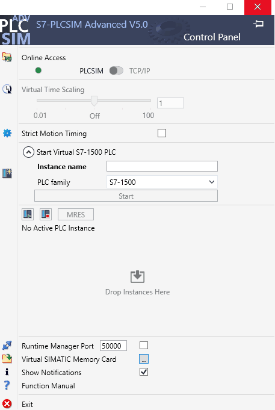
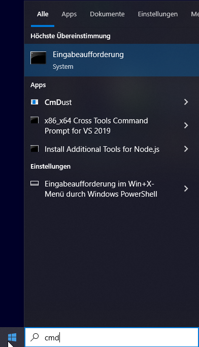
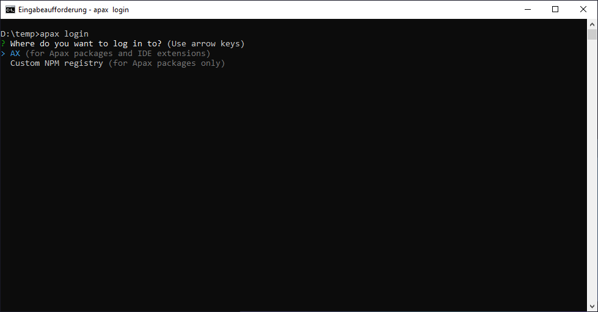
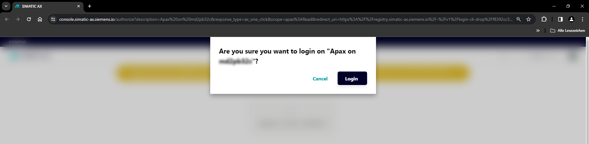
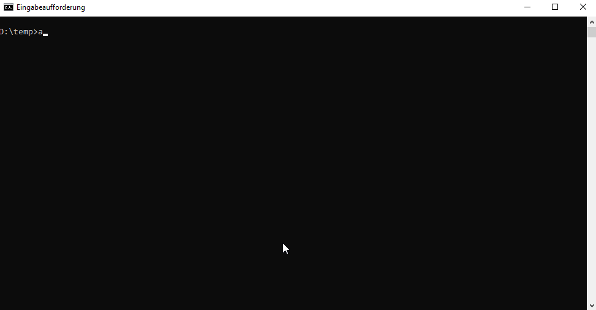
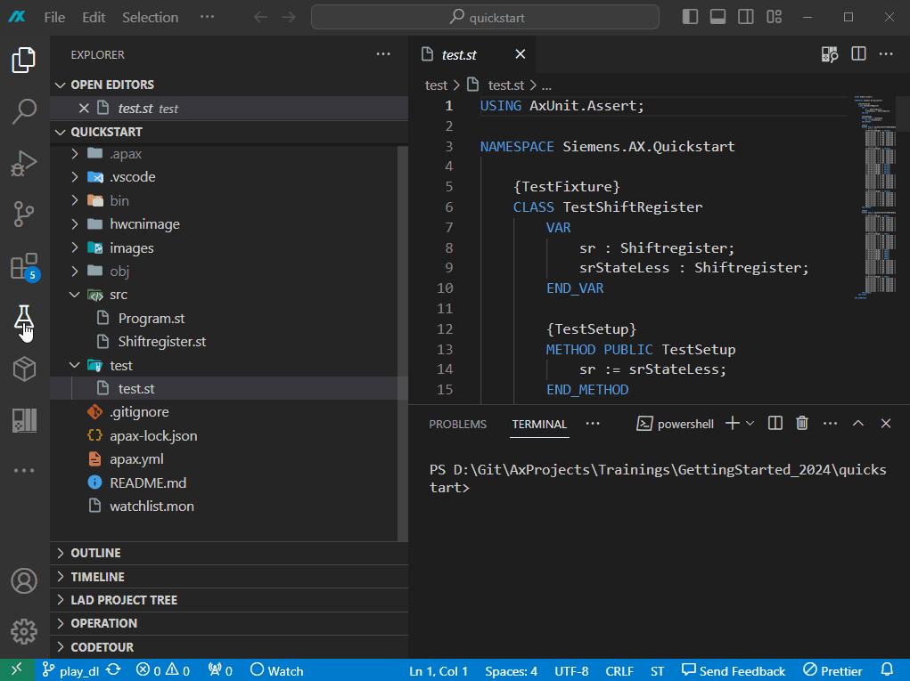
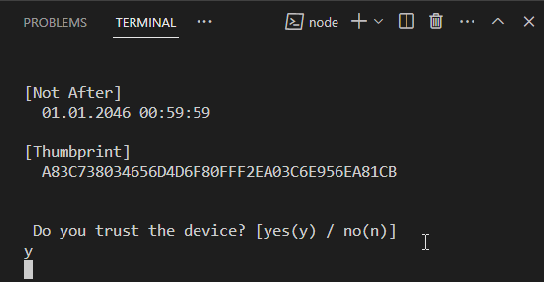
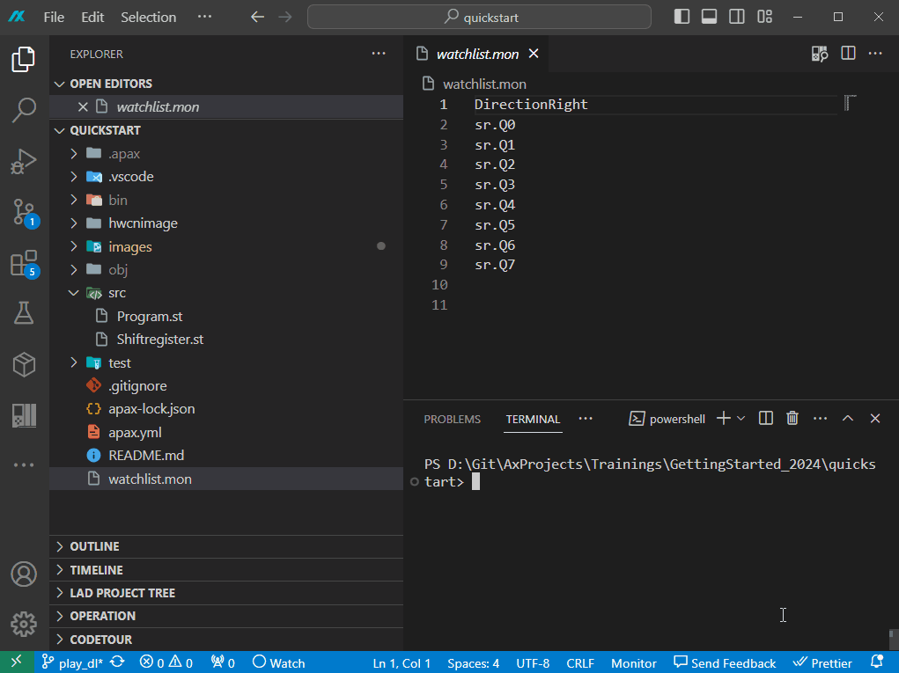
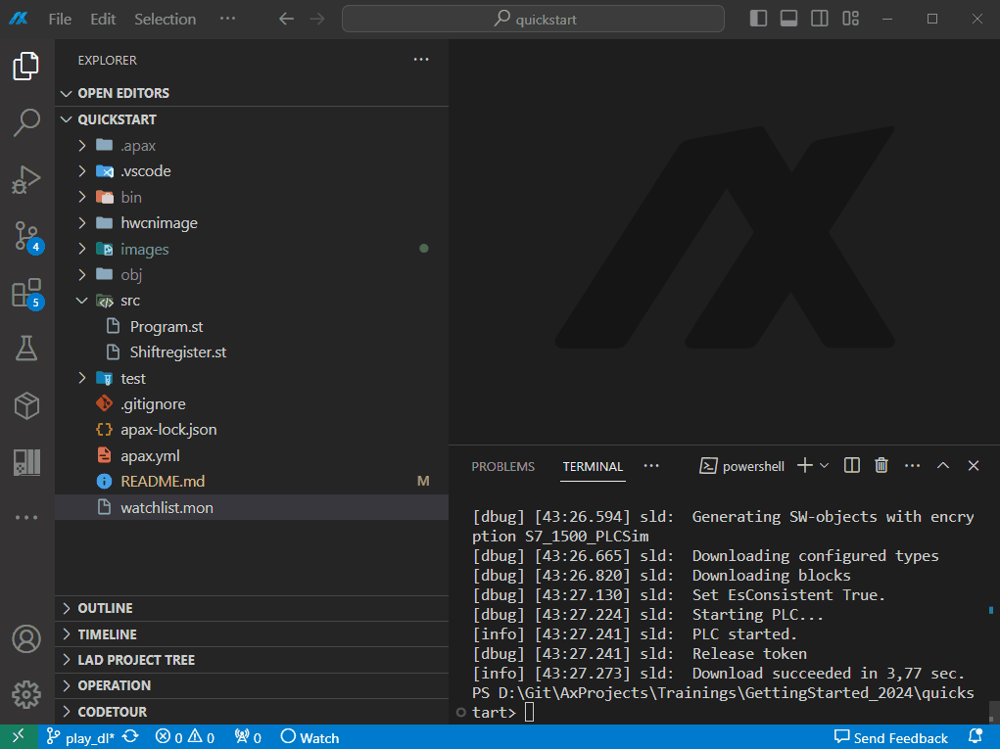
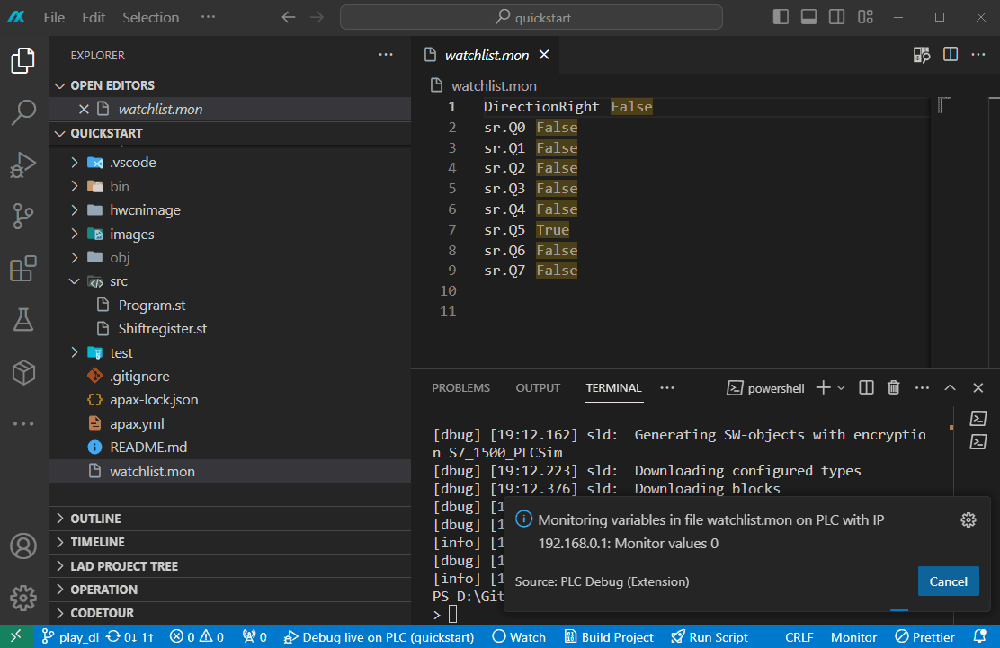

# Quickstart Guide for Simatic AX

Welcome to the Quickstart Guide for Simatic AX! This guide is designed to help you get up and running with Simatic AX as quickly and easily as possible. Our goal is to familiarize you with the essential features without diving too deep into details. For more in-depth information, we recommend referring to the extended [getting started](README.md) documentation.  

## What to Expect?

### 1. Pre-made Templates

To simplify the onboarding process, we use pre-made templates. This allows you to focus on the core functionalities without having to build everything from scratch.

### 2. Example Project

The included example project features a shift register that shifts by one bit with each clock cycle. This will help you quickly grasp the basic functionality of Simatic AX.

### 3. Unit Testing Framework

We demonstrate how to perform tests within the Unit Testing Framework. This is a crucial step to ensure the reliability and functionality of your programs.

### 4. Deploying the Project to the PLC

Learn how to upload your finished project to the Programmable Logic Controller (PLC). This is a key step to bring your developments into the real world.

### 5. Online Functions: Monitoring and Modifying

Discover how to monitor and modify variables using online functions. These tools are essential for checking the status of your control system and making adjustments as needed.

## Conclusion

This Quickstart Guide is intentionally kept simple and focuses on the essentials. It may feel a bit like magic at times, but that's the goal – we want you to get up and running quickly and efficiently. For deeper insights and detailed explanations, please refer to the extended Getting-Started documentation.

Have fun with your journey into Simatic AX!  

## Prepare

1. **Start PLCSIM Advanced**  

    - Create a new PLCSIM Advanced instance

    

1. Open a command line interface

    

1. **Login to the AX registry**  

    ```sh  
    apax login  
    ```  

    Select the AX registry by pressing `Enter`

    

    An browser window will be opened.

    

    Press the `Login` button

    Result:

    

1. **Create the Quickstart project**  

    ```sh
    git clone git@code.siemens.com:axcercise/getting-started.git
    ```

    In the future, it can be created by the following command

    ```sh  
    apax create quickstart myquickstart  
    ```

1. **Change to the directory**

    ```sh
    cd myquickstart
    ```

1. **Install the dependencies**

    Install the necessary dependencies for your project with the `apax install` command.  

    ```sh
    apax install
    ```

1. **Open the Project with AxCode**  
    Open the created project in AxCode, the integrated development environment (IDE) for Simatic AX.  

    ```sh  
    axcode .  
    ```  

## Play  

1. **Run Tests in the AxUnit Testing Framework**  

    Run the tests in the AxUnit Testing Framework to ensure your code functions correctly.  

    

1. **Load Hardware Configuration, Compile Project, and Deploy to PLC**  
    Use the `apax play` script to load the hardware configuration, compile the project, and deploy it to the PLC.  

    ```bash
    apax play  
    ```

    > While downloading the hardware configuration your user input is required. Please confirm it with `y` + `Enter`

    

    Result: The complete application, including hardware configuration, will be downloaded to the PLCSIM Advanced instance.  

    

1. **Monitor Variables**

    Observe the variables in your application to ensure they have the expected values.  

    Open the file `watchlist.mon` file and start the monitoring.

    

2. **Change a Variable**  
    Change the value of one of the monitored variables to see how it affects your application.  
    - Start the debugger.
    - Select the variable in the monitoring window.  
    - Change the value of the variable.  

    

## Summary

This Quickstart Guide has walked you through the basic steps necessary to create, test, and deploy a Simatic AX project to a PLC. By monitoring and changing variables, you can ensure that your application functions as expected.  

For more information, please consult the official Simatic AX documentation or use our [getting started](README.md).
